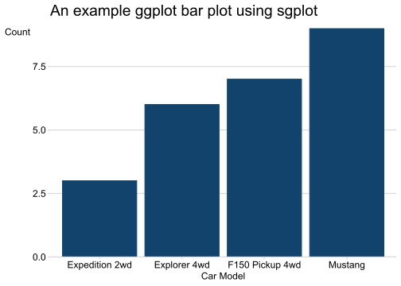

<!-- README.md is generated from README.Rmd. Please edit that file -->

# sgplot 

<!-- badges: start -->

[](https://github.com/DataScienceScotland/sgplot/releases/latest)
[](https://github.com/DataScienceScotland/sgplot/actions)

<!-- badges: end -->

sgplot is an R package for creating accessible plots in the Scottish
Government. Currently, functions are available for styling ggplot2
plots.

The package has been developed using the [Government Analysis
Function](https://analysisfunction.civilservice.gov.uk/) Data
Visualisation guidance for
[charts](https://analysisfunction.civilservice.gov.uk/policy-store/data-visualisation-charts/)
and
[colours](https://analysisfunction.civilservice.gov.uk/policy-store/data-visualisation-colours-in-charts/).
sgplot should be used in conjunction with these guidance documents.

More information about the package and its functions can be found on the
[sgplot website](https://DataScienceScotland.github.io/sgplot).

<br>

## Installation

To install sgplot, the remotes package is required. The package can then
be installed directly from GitHub with:

``` r
remotes::install_github(
  "DataScienceScotland/sgplot",
  upgrade = "never"
)
```

Network security settings may prevent `remotes::install_github()` from
working. If this is the case, sgplot can be installed by downloading the
[zip of the
repository](https://github.com/DataScienceScotland/sgplot/archive/main.zip)
and running the following code, replacing the section marked `<>`
(including the arrows themselves) with the location of the downloaded
zip:

``` r
remotes::install_local(
  "<FILEPATH OF ZIPPED FILE>/sgplot-main.zip",
  upgrade = "never"
)
```

<br>

## Getting Started

Once installed, sgplot can be loaded using the `library()` function:

``` r
library(sgplot)
```

Help files for each function in the package can be found on the
[References](https://datasciencescotland.github.io/sgplot/reference)
page of the package website. Alternatively, type `?function_name` into
the RStudio console. For example:

``` r
?theme_sg()
```

<br>

### Use sgplot as default

The easiest way to use sgplot is by adding `use_sgplot()` to the
beginning of your R script, Rmarkdown document or Shiny app code. This
function will set a number of defaults to ggplot2 geoms, use sgplot
colour palettes and use `theme_sg()`.

#### Example 1: Plot with one colour using ggplot2 defaults

``` r
library(ggplot2)

d <- subset(mpg, manufacturer == "ford")

ggplot(d, aes(x = model)) + geom_bar()
```


#### Example 2: Plot with one colour using sgplot defaults

``` r
sgplot::use_sgplot()

ggplot(d, aes(x = tools::toTitleCase(model))) + 
  geom_bar() +
  # Make some other adjustments to improve look of plot
  scale_y_continuous(expand = c(0, 0)) +
  labs(
    title = "An example ggplot bar plot using sgplot",
    x     = "Car Model",
    y     = "Count"
  ) 
```



<br>

## Licence

Unless stated otherwise, the codebase is released under [the MIT
License](LICENSE). This covers both the codebase and any sample code in
the documentation.

The documentation is [© Crown
copyright](http://www.nationalarchives.gov.uk/information-management/re-using-public-sector-information/uk-government-licensing-framework/crown-copyright/)
and available under the terms of the [Open Government
3.0](http://www.nationalarchives.gov.uk/doc/open-government-licence/version/3/)
licence.
