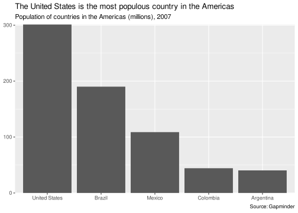
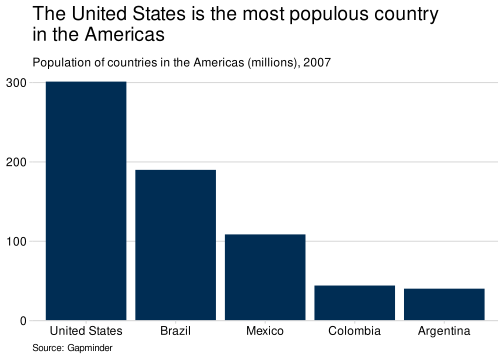

<!-- README.md is generated from README.Rmd. Please edit that file -->

# sgplot 

<!-- badges: start -->

[](https://CRAN.R-project.org/package=sgplot)
[](https://github.com/ScotGovAnalysis/sgplot/actions/workflows/R-CMD-check.yaml)
<!-- badges: end -->

sgplot is an R package for creating accessible plots in the Scottish
Government. Currently, functions are available for styling ggplot2
plots.

The package has been developed using the [Government Analysis Function
Data Visualisation
guidance](https://analysisfunction.civilservice.gov.uk/policy-store/data-visualisation-charts/)
and uses accessible colour palettes from the [Scottish Government Design
System](https://designsystem.gov.scot/guidance/charts/data-visualisation-colour-palettes).
sgplot should be used in conjunction with these guidance documents.

More information about the package and its functions can be found on the
[sgplot website](https://ScotGovAnalysis.github.io/sgplot/). In
particular, the
[cookbook](https://ScotGovAnalysis.github.io/sgplot/articles/cookbook.html)
contains lots of examples. Slides are also available for an internal
[presentation given to statisticians and
analysts](https://alice-hannah.github.io/presentations-and-blogs/2023-06-19_sgplot/slides.html).

## Installation

If you are working within the Scottish Government network, you can
install sgplot in the same way as with other R packages.

Alternatively, install from CRAN:

``` r
install.packages("sgplot")
```

Or install the development version from GitHub:

``` r
# install.packages("remotes")
remotes::install_github(
  "ScotGovAnalysis/sgplot",
  upgrade = "never",
  build_vignettes = TRUE
)
```

## Getting Started

Once installed, sgplot can be loaded using the `library()` function:

``` r
library(sgplot)
```

Help files for each function in the package can be found on the
[References](https://ScotGovAnalysis.github.io/sgplot/reference/) page
of the package website. Alternatively, type `?function_name` into the
RStudio console. For example:

``` r
?theme_sg()
```

### Use sgplot as default

The easiest way to use sgplot is by adding `use_sgplot()` to the
beginning of your R script, Rmarkdown document or Shiny app code. This
function will set a number of defaults to ggplot2 geoms, use sgplot
colour palettes and use `theme_sg()`.

#### Example 1: Plot with one colour using ggplot2 defaults

``` r
library(sgplot)
library(ggplot2)
library(dplyr)
library(gapminder)

gapminder |> 
  filter(year == 2007 & continent == "Americas") |>
  slice_max(order_by = pop, n = 5) |>
  ggplot() +
  geom_col(aes(x = reorder(country, -pop), y = pop)) +
  scale_y_continuous(
    labels = scales::label_number(scale = 1E-6),
    expand = c(0, 0)
  ) +
  labs(
    x = NULL,
    y = NULL,
    title = "The United States is the most populous country in the Americas",
    subtitle = "Population of countries in the Americas (millions), 2007",
    caption = "Source: Gapminder"
  )
```



#### Example 2: Plot with one colour using sgplot defaults

``` r
sgplot::use_sgplot()

gapminder |> 
  filter(year == 2007 & continent == "Americas") |>
  slice_max(order_by = pop, n = 5) |>
  ggplot() +
  geom_col(aes(x = reorder(country, -pop), y = pop)) +
  scale_y_continuous(
    labels = scales::label_number(scale = 1E-6),
    expand = c(0, 0)
  ) +
  labs(
    x = NULL,
    y = NULL,
    title = "The United States is the most populous country \nin the Americas",
    subtitle = "Population of countries in the Americas (millions), 2007",
    caption = "Source: Gapminder"
  )
```



**Note on use of titles, subtitles and captions** <br> Titles, subtitles
and captions have been embedded in these example charts for
demonstration purposes. However, for accessibility reasons, it is
usually preferable to provide titles in the body of the page rather than
embedded within the image of the plot. More information is available in
the [accessibility
article](https://ScotGovAnalysis.github.io/sgplot/articles/accessibility.html#other-accessibility-considerations).

## Licence

Unless stated otherwise, the codebase is released under [the MIT
License](LICENSE). This covers both the codebase and any sample code in
the documentation.

The documentation is [© Crown
copyright](https://www.nationalarchives.gov.uk/information-management/re-using-public-sector-information/uk-government-licensing-framework/crown-copyright/)
and available under the terms of the [Open Government
3.0](https://www.nationalarchives.gov.uk/doc/open-government-licence/version/3/)
licence.
